# DOM Manipulation Solution &nbsp;

## Project 1 :-

&nbsp;

### **Screenshot:**

&nbsp;

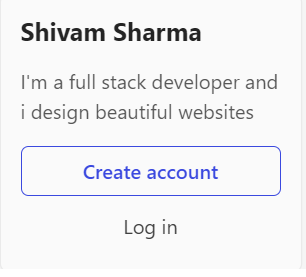

&nbsp;

### **Code:**

&nbsp;

```javascript
document.querySelector(
  ".side-bar .crayons-card .crayons-subtitle-2"
).innerText = "Shivam Sharma"; // Changes the title

document.querySelector(".side-bar .crayons-card p").innerText =
  "I'm a full stack developer and i design beautiful websites"; // Changes the description
```

&nbsp;

## Project 3:-

&nbsp;

### **Screenshot:**

&nbsp;

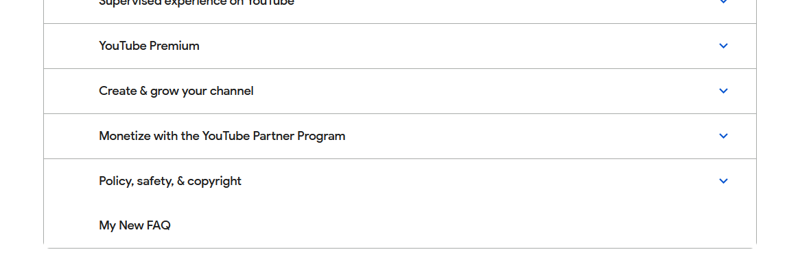

&nbsp;

### **Code:**

&nbsp;

```javascript
let a = document.querySelector(".accordion-homepage");

let newFaq = document.createElement("h3");
newFaq.textContent = "My New FAQ";

a.appendChild(newFaq);
});
```

&nbsp;

## Project 4 :-

&nbsp;

### **Screenshot:**

&nbsp;

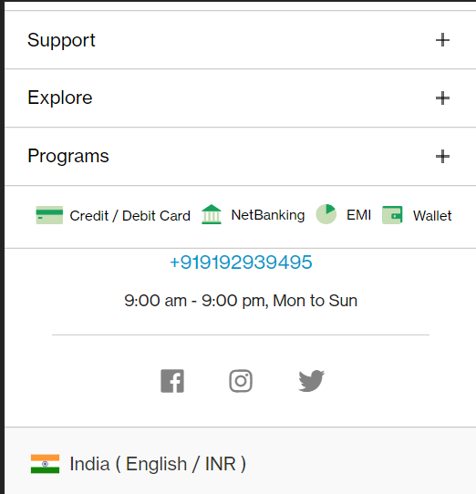

&nbsp;

### **Code:**

&nbsp;

```javascript
document.querySelector(".customer-support .one-tel-number").innerText =
  "+919192939495";
```

&nbsp;

## Project 5:-

&nbsp;

### **Screenshot:**

&nbsp;


&nbsp;

### **Code:**

&nbsp;

```javascript
document.querySelector(
  ".diwali-deals-product-sale-pro .diwali-deals-product-sale-btn"
).innerText = "Check Out";
```

&nbsp;

## Project 6:-

&nbsp;

### **Screenshot:**

&nbsp;

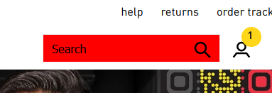

&nbsp;

### **Code:**

&nbsp;

```javascript
let a = document.querySelector(".searchinput___19uW0");

a.addEventListener("mouseover", () => {
  a.style.backgroundColor = "#FF0000";
});
```

&nbsp;

## Project 7:-

&nbsp;

### **Screenshot:**

&nbsp;


&nbsp;

### **Code:**

&nbsp;

```javascript
document.getElementById("top-nav-search-input").value = "Pseudo Classes";

document.getElementById("top-nav-search-form").submit();
```

&nbsp;

## Project 8:-

&nbsp;

### **Screenshot:**

&nbsp;

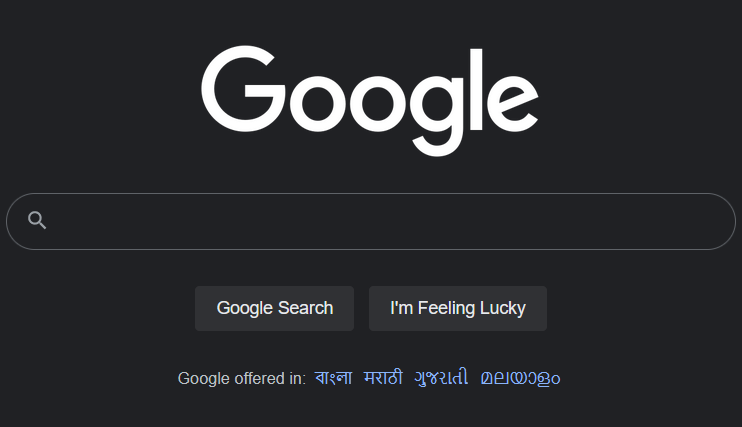

&nbsp;

### **Code:**

&nbsp;

```javascript
let arr = document.querySelectorAll("#SIvCob a");

for (let i = 0; i < arr.length; i++) {
  if (i % 2 != 0) {
    arr[i].remove();
  }
}
```

&nbsp;

## Project 9:-

&nbsp;

### **Screenshot:**

&nbsp;

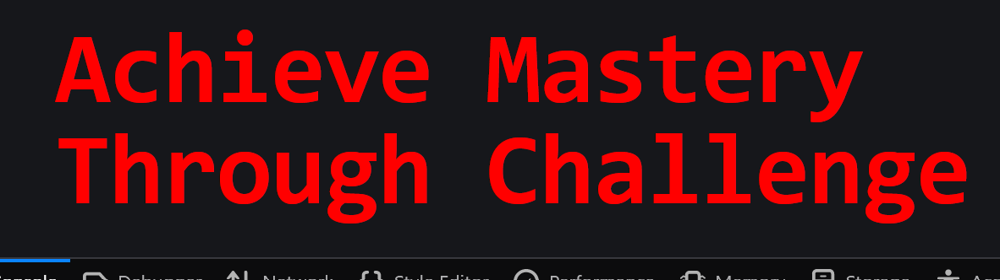

&nbsp;

### **Code:**

&nbsp;

```javascript
document.querySelector(".display-heading-1").style.fontFamily = "monospace";

document.querySelector(".display-heading-1").style.color = "#FF0000";
```

&nbsp;

## Project 10:-

&nbsp;

### **Screenshot:**

&nbsp;

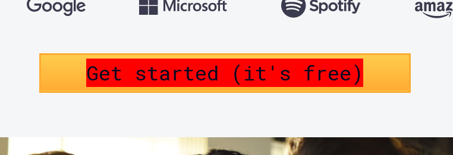

&nbsp;

### **Code:**

&nbsp;

```javascript
let a = document.querySelector(".btn-cta-big .login-btn-text");

a.addEventListener("mouseover", () => {
  a.style.backgroundColor = "#FF0000";
});
```

&nbsp;

## Project 11:-

&nbsp;

### **Screenshot:**

&nbsp;

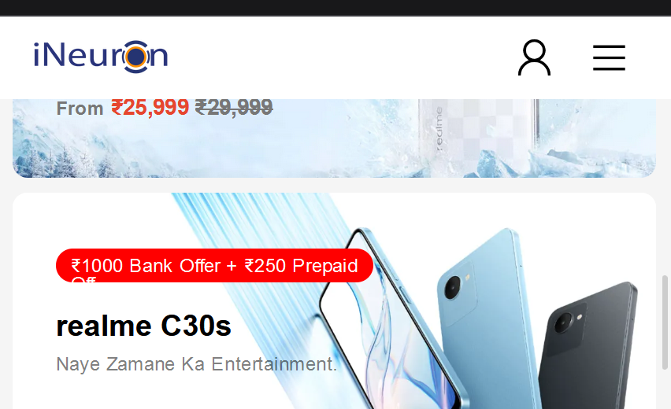

&nbsp;

### **Code:**

&nbsp;

```javascript
document.querySelector(".icon-logo").style.backgroundImage =
  "url('https://ineuron.ai/images/ineuron-logo.png')";
```

&nbsp;

## Project 12:-

&nbsp;

### **Screenshot:**

&nbsp;

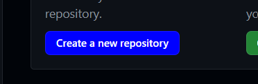

&nbsp;

### **Code:**

&nbsp;

```javascript
let a = document.querySelectorAll(".btn-primary");

a[1].style.backgroundColor = "#0000FF";
```

&nbsp;

## Project 13:-

&nbsp;

### **Screenshot:**

&nbsp;

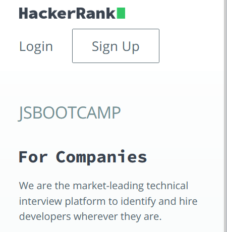

&nbsp;

### **Code:**

&nbsp;

```javascript
document.querySelector(".fl-heading-text").innerHTML = "JSBOOTCAMP";
```

&nbsp;

## Project 14:-

&nbsp;

### **Screenshot:**

&nbsp;

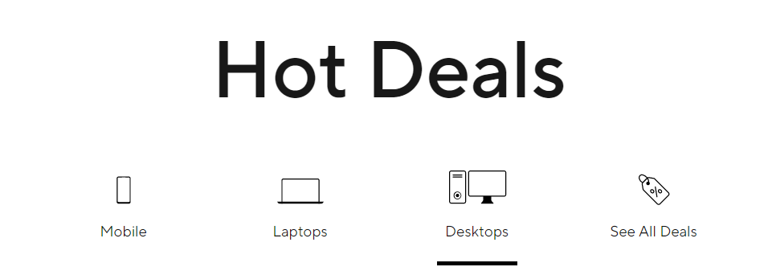

&nbsp;

### **Code:**

&nbsp;

```javascript
document.querySelector(".HotDealsAll__Heading__2fIbe").style.fontSize = "80px";
```

&nbsp;

## Project 15:-

&nbsp;

### **Screenshot:**

&nbsp;


&nbsp;

### **Code:**

&nbsp;

```javascript
let b = document.querySelectorAll(".ps-title");

b[6].style.textAlign = "right";
```

&nbsp;

## Project 16:-

&nbsp;

### **Screenshot:**

&nbsp;

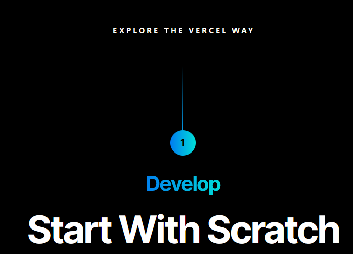

&nbsp;

### **Code:**

&nbsp;

```javascript
document.querySelector(".section-title_title__VEDfK").innerHTML =
  "Start With Scratch";
```

&nbsp;

## Project 17:-

&nbsp;

### **Screenshot:**

&nbsp;

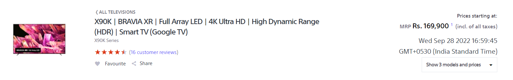

&nbsp;

### **Code:**

&nbsp;

```javascript
const a = new Date();

document.querySelector(".btn-container").innerHTML = a.toString();
```

## Project 18:-

&nbsp;

### **Screenshot:**

&nbsp;

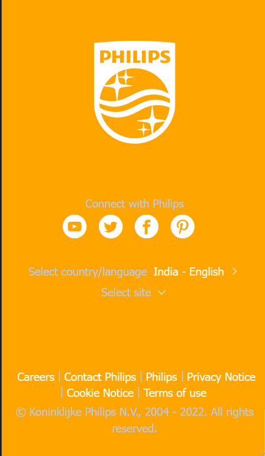

&nbsp;

### **Code:**

&nbsp;

```javascript
document.querySelector(".p-f03-footer-container").style.background = "#FFA500";
```

&nbsp;

## Project 19:-

&nbsp;

### **Screenshot:**

&nbsp;

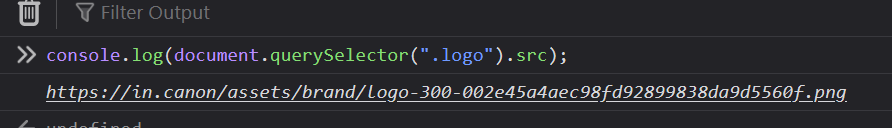

&nbsp;

### **Code:**

&nbsp;

```javascript
console.log(document.querySelector(".logo").src);
```

&nbsp;

## Project 20:-

&nbsp;

### **Screenshot:**

&nbsp;


&nbsp;

### **Code:**

&nbsp;

```javascript
document.querySelector(".section-box .desc").style.color = "#FFA500";
```

&nbsp;
